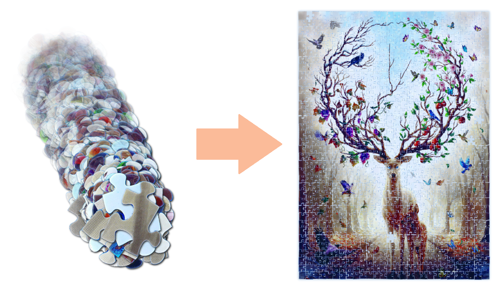

# jigsawlutioner.byWulf - CLI

## About
Jigsawlutioner is an algorithm designed to solve a jigsaw puzzle based on images taken by each puzzle piece.



## Why
Solving jigsaw puzzles by hand should be a relaxing leisure activity. But when it comes to a point, when you have a table full of black pieces, and all you can do it brutforcing them by trying each side to each other sides resolving in 4 solved connections within 2 hours, that is no fun anymore. This algorithm doesn't care about colors and only looks at the individual formed piece borders so it is able to attack exactly this problem case.

## How it works
It parses the border of a piece image and finds the four corners. Now you have four sides. These sides are then compared to all other sides of all other pieces and ranked by a matching probability. With this information, the solver tries to connect all pieces together as best as they fit. It is forgivable, meaning inperfect borders don't prevent a correct solution, because there can always be some shred from the cutting knifes. We are not in a perfect world with perfect borders, but that's not a problem.

## Solvable jigsaw puzzle manufacturers/forms
Currently only standard rectangle puzzles are supported by the algorithm. Although it is design to be able to solve all kind of rectangle puzzles, only Ravensburger puzzles are currently solved correctly. This is because of the very good and individual forms each side gets by Ravensburger. Other manufacturers use too similar or even identical side forms and therefore this algorithm is not suitable for them.

## How to use
### Take images of your puzzle pieces
The most important part are high definition images with no camera distortion of every puzzle piece. The images should be 1000 pixels wide. If you want, you can take a black/white picture and a color picture. 

### Create your set folder
Create a new folder inside `sets/` with the name of your puzzle. Inside this folder, place the images named like `piece1.jpg`, `piece2.jpg`, ... If you have colored imaged, name them like `piece1_color.jpg`...

Additionally create a `meta.json` file with the following content:
```json
{
  "min": 2,
  "max": 501,
  "threshold": 0.65,
  "separateColorImages": true
}
```
`min`/`max` specify the range of the existing images. Instead of a range, you can also specify specific numbers with `"numbers": [1,2,4,5]`.

`threshold` specifies, what pixels should be considered the piece (below) and what pixels should be considered background (above). It is a percentage between 0 (black) and 1 (white).

### Analyze the pieces
The system now must analyze every piece and save their forms for later processing:
```shell
bin/console app:pieces:analyze setname
```
`setname` is the folder name you created earlier. 

Wait for it to finish.

### Solve the puzzle
Now you have all information to create the solution:
```shell
bin/console app:puzzle:solve setname
```
Again `setname` is the folde name you created earlier. 

This creates a html file you can open in your browser and see the solution.
